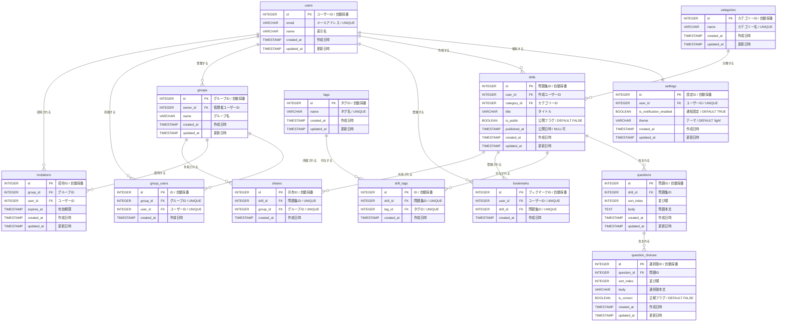

```mermaid
erDiagram
    users ||--|| settings : "保有する"
    users ||--o{ drills : "作成する"
    users ||--o{ bookmarks : "登録する"
    users ||--o{ groups : "管理する"
    users ||--o{ group_users : "所属する"
    users ||--o{ invitations : "招待される"

    categories ||--o{ drills : "分類する"

    drills ||--o{ questions : "含まれる"
    drills ||--o{ drill_tags : "付与される"
    drills ||--o{ bookmarks : "登録される"
    drills ||--o{ shares : "共有される"

    questions ||--o{ question_choices : "含まれる"

    tags ||--o{ drill_tags : "付与する"

    groups ||--o{ group_users : "所属される"
    groups ||--o{ invitations : "招待する"
    groups ||--o{ shares : "共有される"

    users {
        INTEGER id PK "ユーザーID / 自動採番"
        VARCHAR email "メールアドレス / UNIQUE"
        VARCHAR name "表示名"
        TIMESTAMP created_at "作成日時"
        TIMESTAMP updated_at "更新日時"
    }

    settings {
        INTEGER id PK "設定ID / 自動採番"
        INTEGER user_id FK "ユーザーID / UNIQUE"
        BOOLEAN is_notification_enabled "通知設定 / DEFAULT TRUE"
        VARCHAR theme "テーマ / DEFAULT 'light'"
        TIMESTAMP created_at "作成日時"
        TIMESTAMP updated_at "更新日時"
    }

    categories {
        INTEGER id PK "カテゴリーID / 自動採番"
        VARCHAR name "カテゴリー名 / UNIQUE"
        TIMESTAMP created_at "作成日時"
        TIMESTAMP updated_at "更新日時"
    }

    drills {
        INTEGER id PK "問題集ID / 自動採番"
        INTEGER user_id FK "作成ユーザーID"
        INTEGER category_id FK "カテゴリーID"
        VARCHAR title "タイトル"
        BOOLEAN is_public "公開フラグ / DEFAULT FALSE"
        TIMESTAMP published_at "公開日時 / NULL可"
        TIMESTAMP created_at "作成日時"
        TIMESTAMP updated_at "更新日時"
    }

    questions {
        INTEGER id PK "問題ID / 自動採番"
        INTEGER drill_id FK "問題集ID"
        INTEGER sort_index "並び順"
        TEXT body "問題本文"
        TIMESTAMP created_at "作成日時"
        TIMESTAMP updated_at "更新日時"
    }

    question_choices {
        INTEGER id PK "選択肢ID / 自動採番"
        INTEGER question_id FK "問題ID"
        INTEGER sort_index "並び順"
        VARCHAR body "選択肢本文"
        BOOLEAN is_correct "正解フラグ / DEFAULT FALSE"
        TIMESTAMP created_at "作成日時"
        TIMESTAMP updated_at "更新日時"
    }

    tags {
        INTEGER id PK "タグID / 自動採番"
        VARCHAR name "タグ名 / UNIQUE"
        TIMESTAMP created_at "作成日時"
        TIMESTAMP updated_at "更新日時"
    }

    drill_tags {
        INTEGER id PK "ID / 自動採番"
        INTEGER drill_id FK "問題集ID / UNIQUE"
        INTEGER tag_id FK "タグID / UNIQUE"
        TIMESTAMP created_at "作成日時"
    }

    bookmarks {
        INTEGER id PK "ブックマークID / 自動採番"
        INTEGER user_id FK "ユーザーID / UNIQUE"
        INTEGER drill_id FK "問題集ID / UNIQUE"
        TIMESTAMP created_at "作成日時"
    }

    groups {
        INTEGER id PK "グループID / 自動採番"
        INTEGER owner_id FK "管理者ユーザーID"
        VARCHAR name "グループ名"
        TIMESTAMP created_at "作成日時"
        TIMESTAMP updated_at "更新日時"
    }

    group_users {
        INTEGER id PK "ID / 自動採番"
        INTEGER group_id FK "グループID / UNIQUE"
        INTEGER user_id FK "ユーザーID / UNIQUE"
        TIMESTAMP created_at "作成日時"
    }

    invitations {
        INTEGER id PK "招待ID / 自動採番"
        INTEGER group_id FK "グループID"
        INTEGER user_id FK "ユーザーID"
        TIMESTAMP expires_at "有効期限"
        TIMESTAMP created_at "作成日時"
        TIMESTAMP updated_at "更新日時"
    }

    shares {
        INTEGER id PK "共有ID / 自動採番"
        INTEGER drill_id FK "問題集ID / UNIQUE"
        INTEGER group_id FK "グループID / UNIQUE"
        TIMESTAMP created_at "作成日時"
    }
```